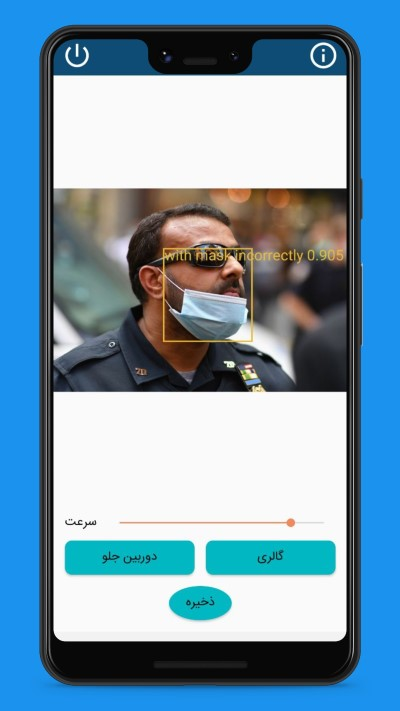
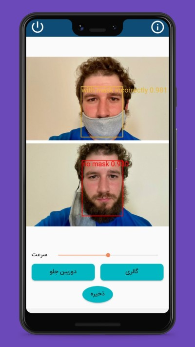
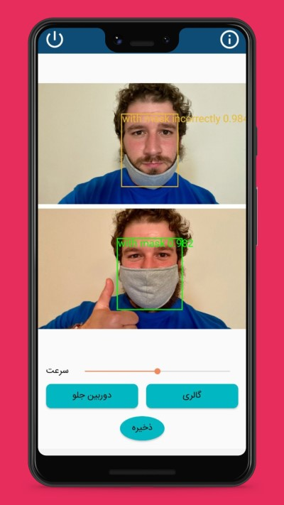
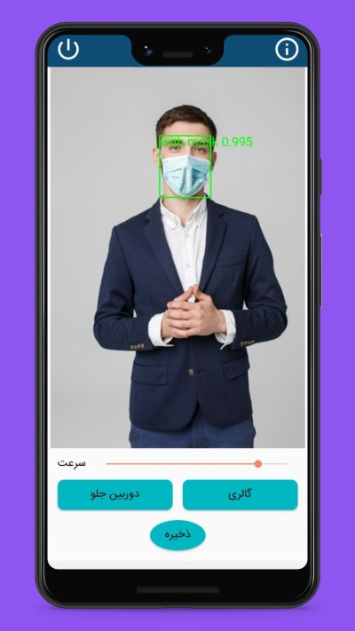

# yolov4 tiny for mask detection

in this repo I used yolov4 for mask detector

# Final Result

{:height="50%" width="50%"}
{:height="50%" width="50%"}
{:height="50%" width="50%"}
{:height="50%" width="50%"}

# Credits 

* [YOLOv4 by AlexeyAB](https://github.com/AlexeyAB/darknet)
* [NCNN by Tencent](https://github.com/tencent/ncnn)
* [YOLOv4 with NCNN by WZTENG](https://github.com/WZTENG/YOLOv5_NCNN)
